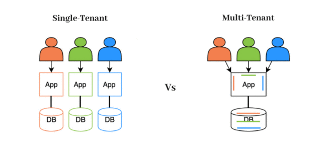

# Soporte para múltiples bots

Una de las grandes fortalezas de **`EVA`** es el hecho de que puede alojar tantos bots como desee, desde una sola instalación. ¿Confundido? Imagine que actualmente tiene varios equipos de trabajo (ventas, soporte, contabilidad, etc.) y que desea tener un bot para cada uno. Si cada área necesitara una propia instancia de EVA, tendría que hacer varias instalaciones y configuraciones, es decir, repetir una y otra vez la misma tarea. Ahora imagínese que desde una sola instancia pueda consolidar todas las áreas, lo que le permite administrar una sola instancia.

Lo primero que debe tener en cuenta al planificar alojar todos los bots en una sola instalación de **`EVA`** es que necesitará tantos tokens de conexión con Slack como bots que desee configurar. Si bien **`EVA`** no impone restricciones en términos de cuántos bots puede alojar y la cantidad comandos que tienen esos bots, es conveniente tener una cuenta de Slack por cada bot, de tal manera que la configuración de cada uno no interfiera con la configuración de otro.

_Single Tenant vs Multi-Tenant_

**`EVA`** utiliza el concepto de programación conocido como [multitenancy](https://en.wikipedia.org/wiki/Multitenancy) para tal propósito.

Si estos conceptos no le resultan familiares puede volver a la sección de [glosario](glossary.md) donde lo revisamos con mayor profundidad.
