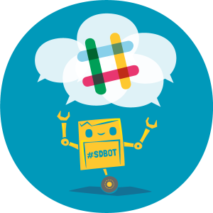

# Glosario

Algunos conceptos esenciales antes de abordar la documentación.

## ¿Qué es un Bot de Slack?

Los bots son aplicaciones de terceros que se ejecutan dentro de Slack. Los usuarios pueden interactuar con estos bots a través de mensajes y comandos que el bot interpreta para generar una respuesta a través del API HTTP de Slack. Los bots nunca comen y nunca duermen, así que un bot esta disponible 7x24x365 recibiendo solicitudes directamente de los usuarios sin ninguna intervención humana necesaria. Además, un bot puede enriquecer y/o extender el contenido de servicios o aplicaciones externas a través de la integración con otras APIs, bases de datos o en general con cualquier sistema, por lo que prácticamente un bot puede hacer cualquier cosa (con la excepción de que los bots no pueden iniciar conversaciones con los usuarios), son los usuarios quienes inician la conversación.

Un bot puede tener su propia personalidad, reflejada por medio de su avatar, su nombre y su descripción, además de brindarle muchos servicios a los usuarios. En **EVA**, un bot puede tener asociados cientos de comandos. Hemos probado con más de 100 comandos obteniendo tiempos de respuesta menores a 0.5 segundos.

***



## ¿Qué es un comando en un bot?

> [!IMPORTANT]
> En adelante supondremos que el administrador estableció que todos los comandos inicien con el carácter `$` (valor predeterminado del sistema). Llamaremos a este valor `prefijo`. Revisaremos este valor con mayor profundidad en la sección de [configuración del sistema](system-config.md)

***
Los usuarios interactúan con el bot a través de consultas en línea (en adelante **comandos**) directamente desde el campo de entrada de texto. Todo lo que necesitan hacer es ingresar un mensaje en un formato que el bot pueda reconocer, presionar Enter y esperar por una respuesta, por lo que los comandos presentan una forma sencilla de comunicarse con el bot. Un comando generalmente utiliza una sintaxis parecida a esto:

```text
[prefijo][comando]
```

donde

`[prefijo]` se trata de un carácter definido por el administrador para reconocer el inicio de un comando, y
`[comando]` es el nombre que el desarrollador definió para reconocer la entrada necesaria para el procesamiento de una orden en el bot.

***


### Alias en comandos

> [!WARNING]
> Recuerde que, para los usuarios escribir o copiar el mismo comando una y otra vez reduce su productividad y los distrae de lo que realmente están haciendo. Así que escoger una palabra de fácil recordación y de fácil escritura puede ayudar a que su comando se utilice más y más veces. Tenga presente si los usuarios potenciales utilizaran el teclado de un computador, una tablet o un teléfono celular y seleccione el conjunto de caracteres que mejor se ajuste a esa situación.

***

Un comando puede tener múltiples alias. Un alias permite reconocer una palabra o serie de palabras con otra. Su intención principal es la de crear un conjunto de palabras o términos que sean familiares para los usuarios que van a hacer uso de los comandos. La definición del alias se hace a través del uso de un patrón de una [expresión regular](https://en.wikipedia.org/wiki/Regular_expression) \(una secuencia de caracteres que conforma un patrón de búsqueda\).

En el artículo donde se describe el [desarrollo de un plugin](../articles/new-plugin.md) revisaremos la creación de un alias con mayor profundidad.

### Ejemplos de comandos

Un posible comando para obtener los detalles de una solicitud podría tener la forma:

| Comando | Descripción |
|:-------:|:-----------:|
|  `$detalles:123` |  `detalles` identifica el comando y `123` es la valor a consultar. |
|  `$d:123` | `d` identifica el comando y `123` es la valor a consultar.  |
|  `$q:123` | `q` identifica el comando y `123` es la valor a consultar. |
|  `$query:123` | `query` identifica el comando y `123` es la valor a consultar.  |

Si esta fuera la situación, un usuario solo tendría que digitar alguno de los textos mencionados en la tabla anterior y presionar Enter :leftwards_arrow_with_hook: para que el sistema generé una respuesta. Así de sencillo es la interacción con el usuario.

#### Recursos relacionados

[Slack API](https://api.slack.com/) | [Interacciones con bots](https://api.slack.com/bot-users) | [Operaciones del API disponibles para bots](https://api.slack.com/bot-users#methods)