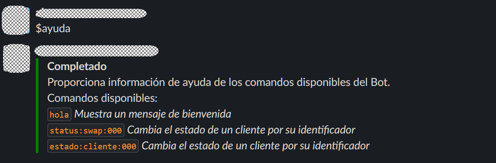

# Plugins

En su forma más simple, un plugin es un complemento de software desarrollado a la medida, que se instala dentro del entorno de ejecución de **`EVA`** y que permite mejorar sus capacidades. Por ejemplo, si desea que un comando conecte con una base de datos y actualice un registro, puede desarrollar un complemento para hacerlo. Si el complemento no está instalado,  **`EVA`** no entenderá cual es la solicitud que el usuario desea resolver.

Un plugin puede mantener su propia configuración (en el ejemplo anterior la cadena de conexión con la base de datos) y recupérala en tiempo de ejecución lo que facilita la centralización de la configuración y simplifica el desarrollo de funcionalidades.

La configuración del plugin se puede establecer cuando sea necesario, durante el proceso de instalación del plugin a través del archivo de manifiesto de instalación. Hablaremos de este archivo en la sección [creación de un plugin](../articles/new-plugin.md).

## Plugins del sistema

La versión 1.0 de **`EVA`** dispone varios plugins de contenido que intentan facilitar la interacción del usuario con bot y al mismo tiempo simplificar la administración.

### Plugin de Ayuda

Muestra la información de todos los comandos disponibles en el bot, así como su forma de uso. Responde cuando el usuario ingresa el texto $ayuda en la caja de entrada.

*Ejemplo de la salida del comando de ayuda*

### Plugin de enrolamiento

Facilita que un usuario se agregue a un rol a través del uso de un código de enrolamiento. En la sección [Establecer permisos de ejecución](security-summary.md) hablaremos de este tema con mayor profundidad.

*Responder a invitación*

### Plugin Feedback

- Captura una sugerencia de mejora del producto
- Muestra la lista de sugerencias de todas las ideas enviadas por la comunidad de usuarios.
- Permite enviar comentarios para una sugerencia de mejora y asignar/eliminar un voto.

*Capturar ideas de mejora directamente de los usuarios*

#### Recursos relacionados

[ Creación de un plugin](../articles/new-plugin.md) | [Instalar un plugin](../articles/deploy-plugin.md) | [Probar un plugin](../articles/testing-plugin.md)