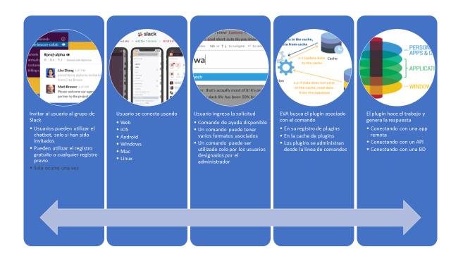

# Procesamiento de una solicitud

El ciclo de vida para atender una solicitud en EVA consta de 5 pasos básicos:

1. El usuario hace login en [slack.com](https://slack.com/) o ingresa al espacio de trabajo a través de una de las [aplicaciones de Slack.](https://slack.com/downloads)
2. El usuario utiliza alguna de las [aplicaciones de Slack](https://slack.com/downloads) o [la página web](https://slack.com/) para enviar un comando al bot.
3. **EVA** recibe la solicitud y busca un comando que coincida con el texto ingresado por el usuario.
4. **EVA** crea una instancia del plugin que hospeda el comando, pasándole la información ingresada por el usuario.
5. El comando procesa la solicitud y genera la respuesta que será entregada por **EVA** al API de Slack.

## Prerequisitos

- El usuario acepto la invitación para unirse al espacio de trabajo.
- El administrador instaló el plugin que proporciona la funcionalidad del comando.
- El administrador configuró los permisos necesarios para que el usuario pueda hacer uso de los comandos.

### Vision general

#### Recursos relacionados

[Aplicaciones de Slack](https://slack.com/downloads) | [Instalación de un plugin](../articles/deploy-plugin.md) | [Establecer permisos de ejecución](../api/security-summary.md)