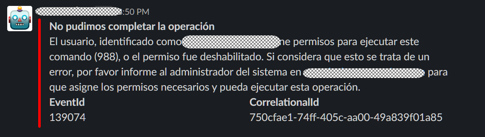

# Permisos de ejecución

Para que un usuario pueda hacer uso de un comando, se deben cumplir algunos criterios de seguridad. Estos criterios son en su orden:

1. El usuario de Slack debe estar registrado como un usuario de **`EVA`**.
2. El usuario debe estar habilitado en el sistema **`EVA`**.
3. El comando que intenta utilizar existe y está habilitado en el sistema **`EVA`**.
4. El usuario debe tener asociado un permiso de ejecución del comando directamente o a través de algún role.

Cuando estos criterios se cumplen, el usuario podrá hacer uso del comando. Si alguno de los criterios no se cumple, **`EVA`** generará una respuesta indicándole al usuario tal situación. Estos mensajes se pueden revisar más tarde en los logs del sistema y se pueden ubicar fácilmente porque el identificador del evento de asociado comienza por 139.

> [!IMPORTANT]
> Los identificadores de eventos se agregan en tiempo de ejecución cuando **`EVA`** encuentra que no puede completar una operación. Su única intención es facilitar la búsqueda en el código fuente de la condición excepcional que impide completar la operación.