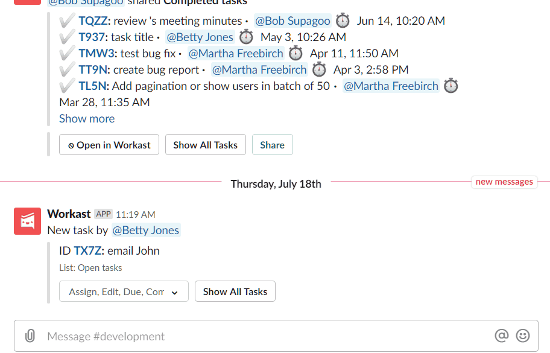
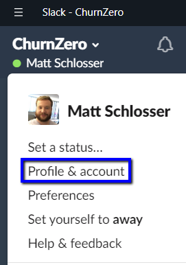
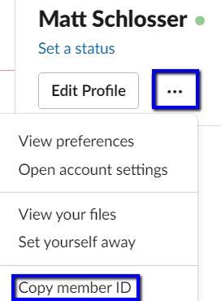

# Usuarios

**`EVA`** no administra credenciales de acceso. La única verificación que realiza **`EVA`** es si se reconoce al usuario, por lo que se requiere que exista un registro en el repositorio de datos de **`EVA`** con al menos el nombre de identificación de registro en la plataforma Slack, de los usuarios autorizados para hacer uso del bot. Por lo general este nombre tiene la forma @username. Lamentablemente este valor en Slack siempre ha sido mutable y no se garantiza la unicidad, por lo que la recomendación para todos los escenarios es que los usuarios utilicen su número de identificación para evitar posibles conflictos con otros usuarios.

Sin emgarbo, también es posible identificar al usuario a través de su ID de miembro de Slack, cuyo valor no cambia, es único y  el usuario no lo puede modificar.

## ¿Cómo encontrar el ID de miembro de Slack? Opción 1

1. Haga clic en un nombre de usuario dentro de Slack.
2. Haga clic en "Ver perfil" en el menú.
3. Haga clic en el ícono más "..."
4. Haga clic en "Copiar ID".

_Copiar ID de miembro de Slack_

## ¿Cómo encontrar el ID de miembro de Slack? Opción 2

1. Haga clic en el nombre de su empresa en la esquina superior izquierda y seleccione Perfil y cuenta

2. Desde el panel que aparece a la derecha de la página, haga clic en  Más acciones  (tres puntos) y luego seleccione  Copiar ID de miembro.

> [!TIP]
> **`EVA`** siempre buscará la identificación del usuario por ambos campos (@username y/o member ID)

#### Tareas relacionadas con usuarios

- [Crear un usuario](#)
- [Bloquear un usuario](#)
- [Eliminar usuario](#)
