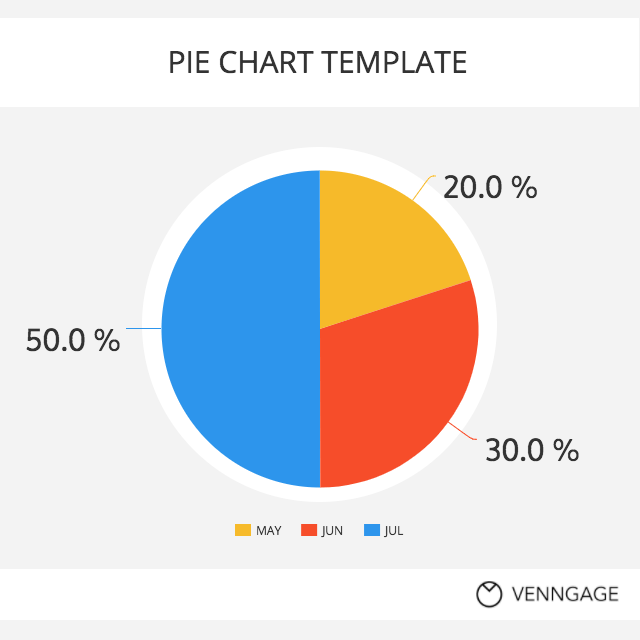
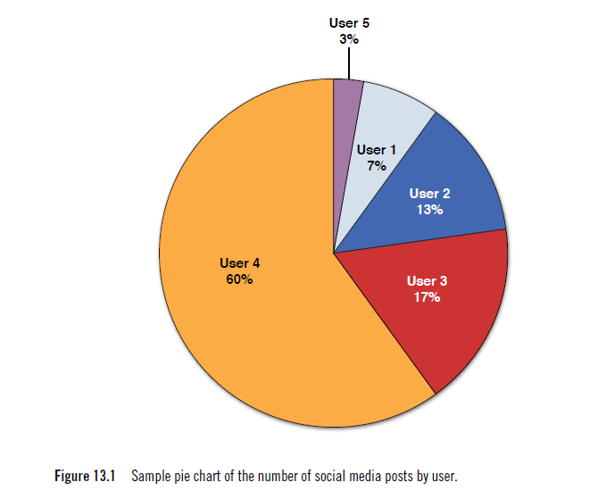
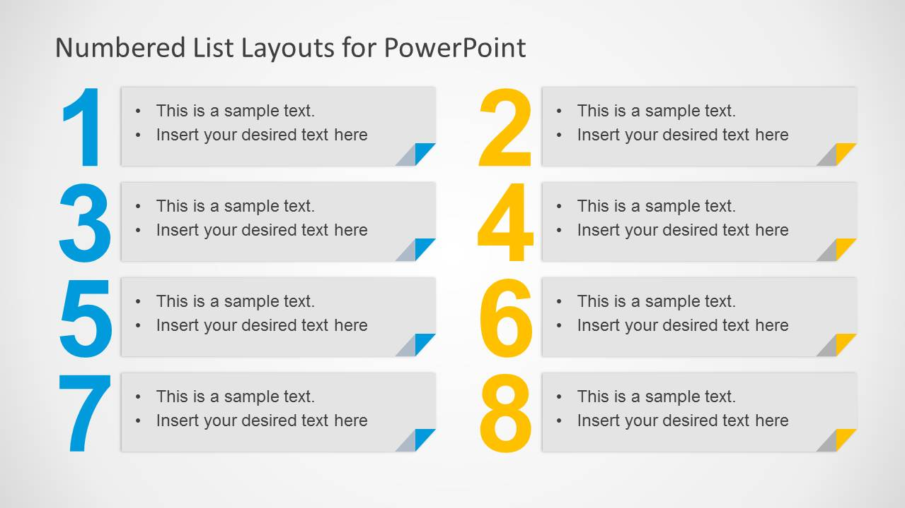

# Estadísticas de uso

EVA almacena métricas e informaciones útiles sobre cada comando/plugin; como el número de veces que se ha utilizado, y algunas clasificaciones que pueden ser útiles. Revise periódicamente las estadísticas de uso para comprender cómo está funcionando el sistema y cuales comandos podrían requerir de ajustes. 

Distinga las tendencias de uso con promedios mensuales o revise que alertas se están generando para detectar cambios repentinos en el uso y considerar la implementación de nuevos comandos, o descargue cualquier informe para realizar su propio análisis.

Los cambios en el uso de la aplicación pueden indicar cosas buenas y malas: el éxito de un comando o los usuarios que llegan a una condición de la aplicación donde comienzan a producirse fallos. Al evaluar rutinariamente las estadísticas y alertas de la aplicación, puede detectar rápidamente los cambios y luego corregir los problemas antes de que afecten negativamente la experiencia de sus usuarios.

El uso de informes es la forma en que las empresas aprenden sobre los hábitos de los usuarios durante ciertos períodos de tiempo en función de los datos generados. Los informes pueden ayudar a la compañía a predecir patrones, corregir errores y alterar el producto de manera efectiva. Estos reportes son una forma importante de controlar el uso de los sistemas de la compañía.

## Reportes disponibles

### Reporte de uso de comandos

Muestra cuales han sido los comandos más utilizados para un periodo de tiempo. Con la información de este reporte puede planificar que tan exitosa ha sido la implementación y uso de cada comando en el sistema.  

### Reporte de usuarios más activos

¿Qué tanto utilizan los usuarios el sistema? Este reporte le ayuda a determinarlo. 

### Reporte de Feedback

El plugin de Feedback proporciona un mecanismo para que los usuarios se comuniquen sus ideas y necesidades. Este reporte le ayuda a identificar las ideas más populares.

