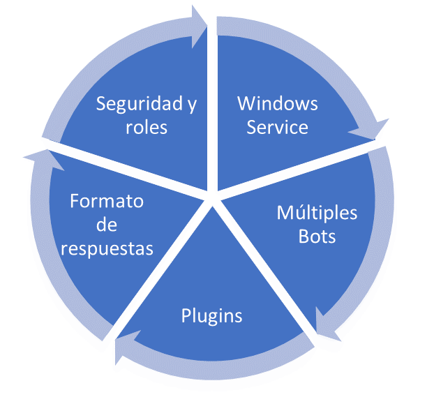

# Tecnología de la plataforma EVA

Los servicios de Windows son un componente central del sistema operativo y permiten la creación y administración de procesos de larga duración. Un servicio se ejecuta en segundo plano, incluso si nadie ha iniciado sesión en la máquina y se iniciara de forma automática cuando se arranque la máquina, que se convierte en una necesidad fundamental si no se desea tener que mantener un usuario conectado para mantener el servicio en funcionamiento.

**EVA se ejecuta como un servicio del sistema operativo. El instalador del servicio lo configurará de esa forma.**

La interacción con el servicio se puede hacer a través de un módulo de PowerShell diseñado para tal fin, y este módulo puede ser ejecutado desde cualquier computadora que pueda alcanzar a través de la red el servidor donde se ejecuta el servicio.

## Soporte para múltiples bots

Se pueden crear múltiples bots en una sola instancia con un proceso de instalación básica. Cada bot puede tener sus propios comandos, cada uno proporcionando funcionalidades específicas. Cada bot puede tener su configuración separada, administrando sus propios usuarios y permisos de seguridad.

[Más información aquí](bot-instances.md)

## Extensiones / plugins

El marco de extensiones proporciona una base sólida para alojar sus comandos y ampliar las necesidades de cara a los usuarios a través del entorno de ejecución de EVA. Este enfoque hace que sea mucho más fácil realizar cambios en un comando sin afectar otras funcionalidades.

[Más información aquí](introducing-plugins.md)

## Variedad de opciones de respuesta

Un conjunto de clases base extensibles, permiten a los desarrolladores generar respuestas en múltiples formatos con el fin de simplificar el proceso de comprensión de los resultados para los usuarios, utilizando respuestas simples, en forma de lista o inclusive en formato [**markdown**](https://en.wikipedia.org/wiki/Markdown).

[Más información aquí](../articles/format-output.md)

## Seguridad basada en roles

Con la seguridad que se extiende hasta el nivel de comando, EVA proporciona un modelo de seguridad que le brinda un control completo y altamente granular sobre quién puede hacer uso de un comando. La agrupación basada en roles simplifica la gestión de la seguridad, con permisos específicos otorgados a los usuarios en función de sus roles o sus identificadores individuales.

[Más información aquí](security-summary.md)

### Temas relacionados

[Configuración del sistema](../api/system-config.md) | [Instalación de un plugin](../articles/deploy-plugin.md) | [Establecer permisos de ejecución](../api/security-summary.md)
