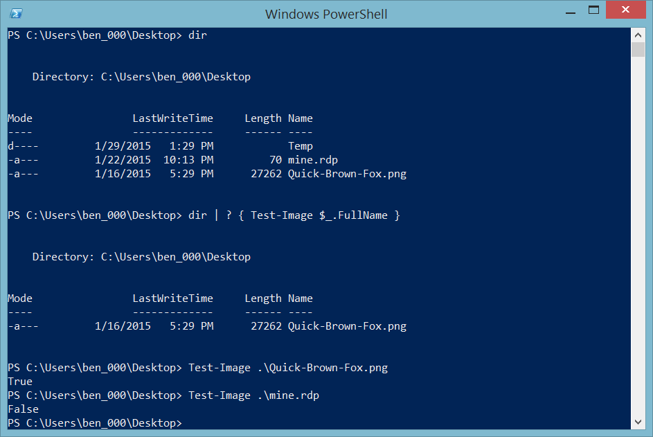

# Seguimiento de una solicitud

Para cada solicitud entrante, **`EVA`** genera y asigna un código de seguimiento (**CorrelationalId**). Esta información se guarda en el repositorio de datos, que luego se puede utilizar para analizar o para reproducir una serie específica de pasos al intentar diagnosticar un problema o para simplemente determinar cuál fue el resultado al procesamiento de un comando mostrado al usuario. Cuando se necesite, un comando o plugin personalizado también puede agregar información de seguimiento a través del uso de la interfaz, `ITracking`. Cuando desarrolle su plugin, si desea agregar datos a la información de seguimiento tan solo deberá implementar la interfaz `ITracking` y agregar los datos que se deben guardar con las trazas de seguimiento.

## Consultar la información de un registro por su identificador

Si dispone del valor CorrelationalId, puede utilizar [Cmdlet Get-Trace de PowerShell](powershell-module.md) con el parámetro `CorrelationalId`. Por ejemplo.

```powershell
# Utilizar el valor de CorrelationalId de la solicitud
Get-Trace -CorrelationalId "00000000-0000-0000-0000-000000000000"
```

## Consultar la información de los últimos registros

```powershell
# Últimos 100 registros
Get-Trace -Last 100
```

## Consultar la información para un periodo de tiempo

```powershell
# Todos los registros de hoy
Get-Trace -TimeLapse "Today"
```

## Ejemplo de salida Get-Trace


