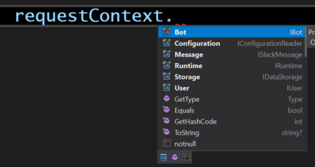

# Contexto de ejecución

Cuando se invoca la acción `Execute` o `GetDeferredDescription` de su plugin, las operaciones reciben dos valores, así:

- **match** del tipo [`Match`](https://docs.microsoft.com/en-us/dotnet/api/system.text.regularexpressions.match)

Que representa los resultados de la coincidencia en la búsqueda de la expresión regular. El texto ingresado por el usuario se encuentra en la propiedad **`Value`** de la clase.

> [!NOTE]
> Si define la captura de grupos en el patrón de reconocimiento del plugin (**`RequestPattern`**), puede utilizar la propiedad `Groups` en el objeto `Match` para acceder a los grupos capturados dentro de la expresión de reconocimiento. Por ejemplo:

```c#
// Si define el patrón de reconocimiento como:
// cmd(?<id>\d{1,3})
// En su plugin puede recuperar el valor de la siguiente forma
int id = Convert.ToInt32(match.Groups["id"].Value);
```

- **requestContext** del tipo **`IRequestContext`**

Que representa la información del contexto de ejecución que puede utilizar para:



- **Bot** permite acceder a la información del Bot para el que el usuario realiza la solicitud. Ejemplo:

```c#
    // El nombre del Bot que atiende la solicitud.
    string botName = requestContext.Bot.Name;
```

- **User** permite acceder a la información del usuario que realizó la solicitud. Ejemplo:

```c#
    // El correo del usuario que envió la solicitud.
    string userMail = requestContext.User.Email;
```

- **Message** permite acceder a la información del mensaje en formato plano con el que se realizó la solicitud. Ejemplo:

```c#
    // El texto ingresado por el usuario al enviar la solicitud.
    string requestText = requestContext.Message.RawText;
```

- **Runtime** permite acceder a la información del tiempo de ejecución de la solicitud. Ejemplo:

```c#
    // Fecha y hora en formato UTC de la solicitud.
    DateTimeOffset requestAt = requestContext.Runtime.RequestStartAt;
```

- **Configuration** permite acceder a la información de los valores de configuración del plugin que se establecieron en la instalación a través del archivo de manifiesto. Ejemplo:

```c#
    // ConnectionString que se estableció en la instalación con el nombre Foo.
    string defValue = "DefaultValueIfNotFound";
    string connectionString = requestContext.Configuration.GetConnectionString("Foo", defVal);
```

- **Storage** Las solicitudes al bot no tienen estado. Sin embargo, su plugin puede necesitar rastrear el contexto de una conversación para que pueda administrar su comportamiento o recordar respuestas a preguntas anteriores. El objeto `Storage` le permite guardar y recuperar datos generalmente asociados con la sesión del usuario. Ejemplo:

```c#
    // Guardar en la primera solicitud (se asocia con el usuario).
    requestContext.Storage.Set("LastText", requestContext.Message.RawText);

    // Recuperar en la segunda solicitud.
    // el valor que se relacionó con el usuario en la solicitud anterior.
    string lastText = requestContext.Storage.Get<string>("LastText");
```

#### Grupos de captura

Encontrar un valor en nuestro patrón de reconocimiento es sencillo cuando se utilizan expresiones de grupos, pero la expresión regular se vuelve más avanzada, más larga. Las expresiones regulares de .NET admiten grupos de captura con un nombre, lo que le permitirá asignar un nombre a cada grupo en la expresión regular y luego hacer referencia a este en la propiedad Grupos. Definitivamente apreciará esta característica cuando sus expresiones regulares crezcan en complejidad. Veamos un ejemplo. Supongamos una cadena con el texto: "`Mi nombre es Pepe y tengo 42 años de edad`", pero solo estas interesado en la parte de la edad. Tu código podría tener la siguiente forma:

```c#
string testString = "Mi nombre es Pepe y tengo 42 años de edad";
Regex regex = new Regex(@"^.*(?<edad>[0-9]{2})");
Match match = regex.Match(testString);
if (match.Success)
{
    Console.WriteLine($"La edad es {match.Groups["edad"].Value}");
    // Como el patrón solo admite dos digitos, puedo convertir el valor a un entero directamente.
    int age = Convert.ToInt32(match.Groups["edad"].Value);
}
```

> [!WARNING]
> Las referencias a grupos son la forma más sencilla de procesar el texto de entrada porque permiten de forma segura, extraer partes de la cadena ingresada por el usuario. Conviene familiarizarse con su uso.

> [!Video https://www.youtube.com/embed/baw4It7WRfk]

_C# regular expression groups in 5 min_


> [!Video https://www.youtube.com/embed/EyirQo0a__w]

_Regex Named Captured Groups (C# .NET)_


> [!Video https://www.youtube.com/embed/c9HbsUSWilw]

_Regular Expressions: Capturing Groups_

#### Teamas relacionados

[Regular Expression Language - Quick Reference](https://docs.microsoft.com/en-us/dotnet/standard/base-types/regular-expression-language-quick-reference) | [Grouping Constructs in Regular Expressions](https://docs.microsoft.com/en-us/dotnet/standard/base-types/grouping-constructs-in-regular-expressions) | [Expresso herramienta gratuita para el desarrollo de expresiones regulares en .NET](http://www.ultrapico.com/Expresso.htm)