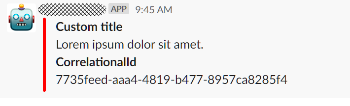
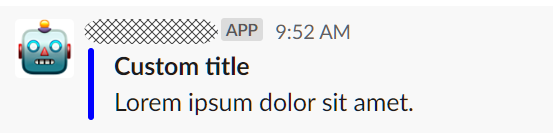
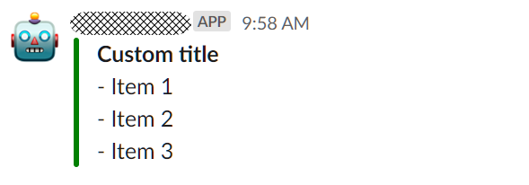
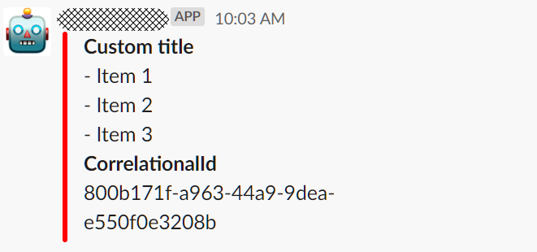
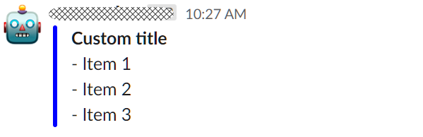
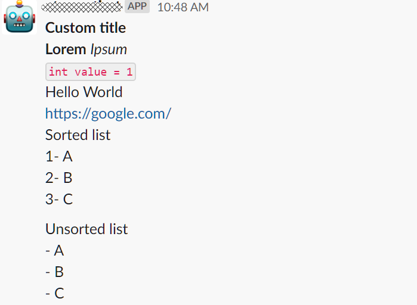

# Dar formato a la salida

La interfaz `IBotMessage` define los campos que serán enviados como salida a los usuarios, por lo que las clases que implementan esta interfaz se pueden utilizar para _generar_ la salida. **`EVA`** dispone de varias clases que puede utilizar para este fin.

Diferentes tipos de salida se pueden generar, pero para los fines de esta documentación hablaremos solo de las clases principales. Sin embargo, tenga en cuenta que siempre podrá extender cualquiera de las clases que se mencionan a continuación y sobrescribir su comportamiento para generar la salida.

## TextMessage

La salida más simple. Muestra un mensaje de texto (que se pasa en el constructor de la clase).

```c#
 return new TextMessage("Lorem ipsum dolor sit amet.");
```


_Ejemplo de salida para TextMessage_

## SuccessfulMessage

Muestra un mensaje de texto y permite establecer un titulo para el mensaje. El color verde que se muestra en el border intenta significar el estado de un _proceso exitoso_.

```c#
    return new SuccessfulMessage("Lorem ipsum dolor sit amet.", "Custom title");
```


_Ejemplo de salida para SuccessfulMessage_

## ErrorMessage

Igual que `SuccessfulMessage` pero intenta significar el estado de un _proceso no exitoso_.

```c#
    return new ErrorMessage("Lorem ipsum dolor sit amet.", "Custom title");
```



_Ejemplo de salida para ErrorMessage_

> [!CAUTION]
> **¿Qué es el valor CorrelationalId?** A todas las solicitudes se les asigna un código de seguimiento que se registra para poder rastear una solicitud. Cuando un comando genera una respuesta no exitosa, **`EVA`** agregará de forma automatica a la salida el código de seguimiento para que se pueda ubicar fácilmente los datos entrantes de la solicitud, así como la respuesta que se mostró al usuario. Este número esta guardado en la información de seguimiento que revisaremos con más detalle en la sección [seguimiento de una solicitud](../api/trace-request.md).

## ColoredMessage

Sirve como clase base para `SuccessfulMessage` y `ErrorMessage`. Sin embargo, la clase no es abstracta por lo que puede utilizarla para generar un mensaje con el color de su elección. 

```c#
    return new ColoredMessage("Lorem ipsum dolor sit amet.", Color.Blue,"Custom title");
```



_Ejemplo de salida para ColoredMessage_


## SuccessfulListMessage

Ideal para mostrar mensajes que representan _procesos exitosos_ asociados con una lista de resultados.

```c#
    string[] items = new[] { "Item 1", "Item 2", "Item 3" };
    return new SuccessfulListMessage("Custom title", items);
```



_Ejemplo de salida para SuccessfulListMessage_


## ErrorListMessage

Ideal para mostrar mensajes que representan _procesos no exitosos_ asociados con una lista de resultados.

```c#
    string[] items = new[] { "Item 1", "Item 2", "Item 3" };
    return new ErrorListMessage("Custom title", items);
```



_Ejemplo de salida para ErrorListMessage_

## ListMessage

Sirve como clase base para `SuccessfulListMessage` y `ErrorListMessage`. Sin embargo, la clase no es abstracta por lo que puede utilizarla para generar un mensaje con el color de su elección y una lista asociada.

```c#
    string[] items = new[] { "Item 1", "Item 2", "Item 3" };
    return new ListMessage("Custom title", Color.Blue, items);
```



_Ejemplo de salida para ListMessage_

## MarkdownBuilder

Esta clase facilita la generación de texto en formato markdown. Luego, puede utilizar este texto como parámetro para cualquier clase que herede de `TextMessage`.

```c#
    string text = MarkdownBuilder.Initialize("Custom title")
                    .NewLine()
                    .Bold("Lorem")
                    .Italic("Ipsum").NewLine()
                    .Code("int value = 1").NewLine()
                    .Plain("Hello World").NewLine()
                    .Link(new Uri("https://google.com")).NewLine()
                    .SortedList("Sorted list", "A", "B", "C").NewLine()
                    .UnsortedList("Unsorted list", "A", "B", "C").EndFormat().ToMarkdown();

    return new TextMessage(text, "Custom Title");
```




_Ejemplo de salida para TextMessage utilizando MarkdownBuilder_


### Temas relacionados
[Seguimiento de una solicitud](../api/trace-request.md) | [Creción de un Plugin](new-plugin.md)