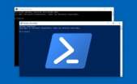
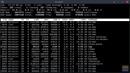

# EVA Slack Edition

**E**vertec **V**irtual **A**ssistant o **`EVA Slack Edition`**, es un servicio que permite responder a una solicitud hecha desde un canal de [Slack](https://slack.com) con un desarrollo personalizado, facilitando la automatización de los flujos de trabajo, y atendiendo al cliente en línea y tiempo real. Ofrezca valor a los usuarios más rápido, utilizando herramientas de automatización del trabajo en todos los equipos. Conéctese con otros sistemas, APIs y/o bases de datos y automatice los procesos de atención a los clientes.

## Desarrollar un plugin

[Desarrolle una extensión/plugin que permita atender una solicitud.](articles/new-plugin.md)

## Administración de plugins

[Administre fácilmente los plugins habilitados para el uso de los usuarios finales.](articles/new-plugin.md)

## Conectado desde la idea hasta el lanzamiento

[Aprenda como hacer seguimiento de todas las solicitudes para verificar que están necesitando sus usuarios.](api/trace-request.md)

## Plugins del sistema

[Conozca los plugins que vienen con el sistema o aprenda a crear sus plugins propios.](api/introducing-plugins.md)
